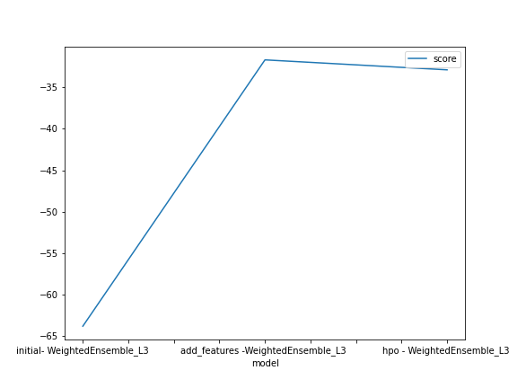
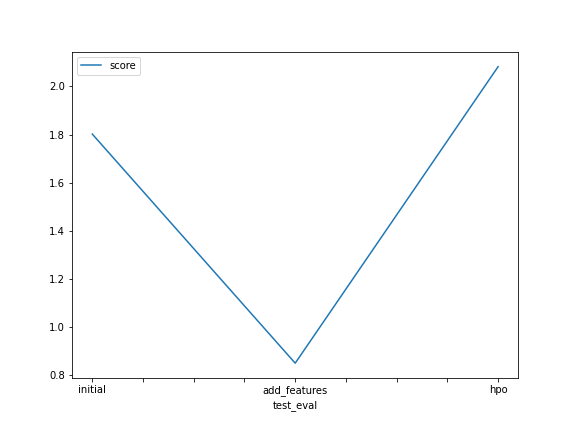

# Report: Predict Bike Sharing Demand with AutoGluon Solution
####  Esha Mishra

## Initial Training
### What did you realize when you tried to submit your predictions? What changes were needed to the output of the predictor to submit your results?
The submission should include datetime and count column. The count column should have predicted values. The datetime column is the index and count column will have corresponding predictions. All predicted values should be positive. Thus, all negative predictions need to be set to zero.

### What was the top ranked model that performed?
WeightedEnsemble_L3 is the best performing model in all three training runs.

## Exploratory data analysis and feature creation
### What did the exploratory analysis find and how did you add additional features?
Season and weather were categorical features. Thus, required one-hot encoding. The datetime column had many feature extracted like year, weekday, month and hour of the day. Another feature, that gives difference of actual and percieved temperature was also created. Some columns were dropped like atemp column since it was higly correlated with temp (about 0.98). Other columns that were dropped were weather, season, datetime, casual and registered.

### How much better did your model preform after adding additional features and why do you think that is?
Model did not perform better with extra features. Probably, because new features increased the size of the training dataset. Thus, to get better result more training time is required. In the first run there were 10 columns and in the second run 20 columns.

## Hyper parameter tuning
### How much better did your model preform after trying different hyper parameters?
Model performnace increased alot after hyper parameter tuning, especially increasing training time helped a lot. The kaggle score went up from 0.779 (new_feature) to 1.83 (new_hpo).

### If you were given more time with this dataset, where do you think you would spend more time?
To increase model performnace I would probably spend mode time hypertuning the high performance model.

### Create a table with the models you ran, the hyperparameters modified, and the kaggle score.
|model|time_limit|refit_full|auto_stack| set_best_to_refit_ful|presets| score|
|predictor|WeightedEnsemble_L3|WeightedEnsemble_L3|WeightedEnsemble_L3|WeightedEnsemble_L3|
|initial|600|Fasle|False|False| best_quality| 1.80
|add_features|600|Fasle|False|False| best_quality| 0.779
|hpo |600| True| True| True| best_quality |1.83

### Create a line plot showing the top model score for the three (or more) training runs during the project.

### Create a line plot showing the top kaggle score for the three (or more) prediction submissions during the project.

## Summary

In Bike Sharing Competetion we need a regression model which can predict demand for bikes based on given features like mo datetime, season, weather, temperature etc.In the first training run the model is trained for 10 minutes with 'best_quality' preset, this preset gave the best accuracy so far. Here, best quality has high predictive accuracy, slower inference times and higher disk usage. The evaluation metric is root_meant_sq_error because this is a regression problem. The kaggle score for the intial training run is 1.80. The second training run, the model is trained after some feature engineering. The second model score on kaggle takes a dip to 0.779. This dip can be attribute to increase in dataset size, as the new dataset has 20 columns compared to 10 earlier. The third training run, after increasing training time to 15 minutes and having auto_stack, refit_full and set_best_to_refit_ful set to True. The model perform much better and gets kaggle score of 1.83.